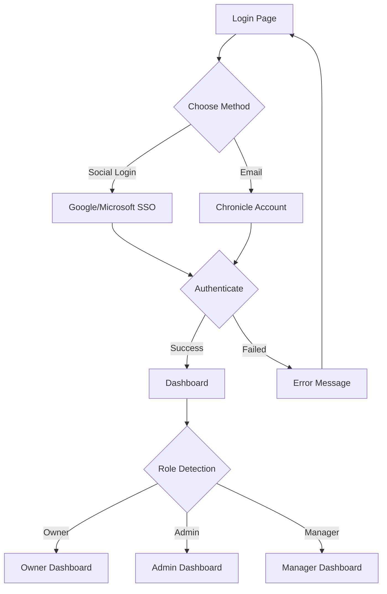
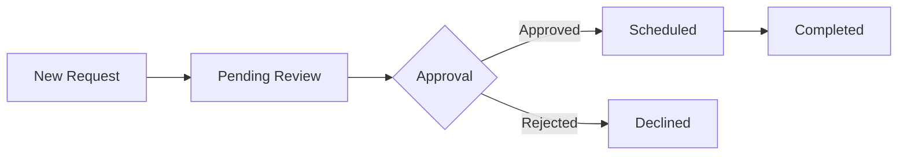
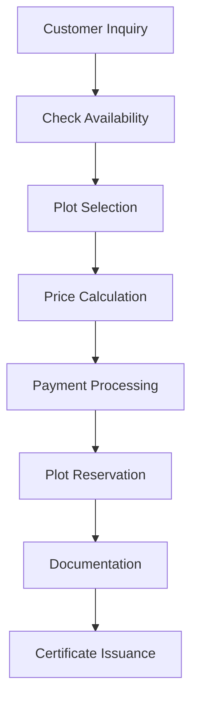
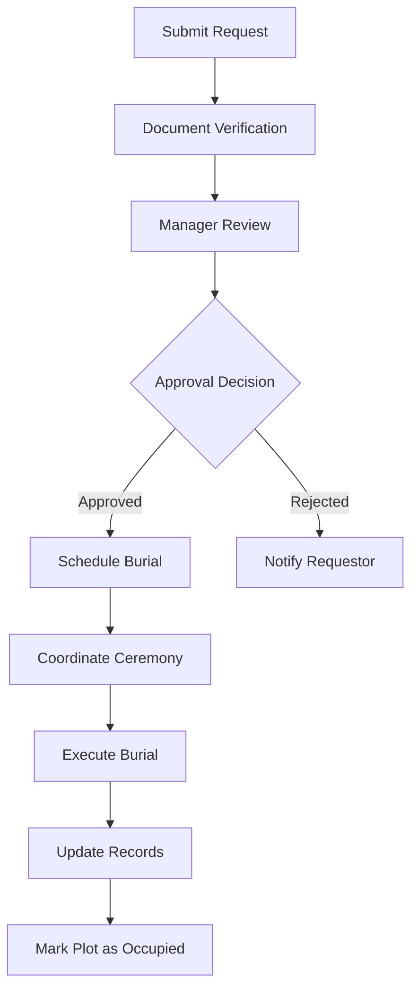
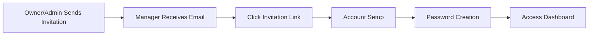

# Chronicle Product Flow

## 🎯 Overview

Chronicle adalah platform manajemen pemakaman (cemetery management) yang memungkinkan organisasi pemakaman untuk mengelola plot, pemakaman, penjualan, dan operasional sehari-hari dengan sistem digital yang terintegrasi.

Platform ini dirancang untuk tiga peran utama:
- **Owner**: Pengelola organisasi dengan akses penuh ke konfigurasi dan laporan
- **Admin**: Administrator operasional untuk manajemen harian
- **Manager**: Manajer lapangan untuk approval dan monitoring

---

## 🔐 Authentication Flow

Chronicle menyediakan beberapa metode autentikasi untuk fleksibilitas dan keamanan:

### Login Methods



**User Journey:**

| Stage | User Action | System Response |
|-------|-------------|-----------------|
| **Selection** | User chooses authentication method (Social, SSO, or Email) | Highlights selected field or redirects to third-party provider |
| **Input** | User enters email and password | Validates data format in real-time |
| **Preference** | User toggles "Remember me" | Stores session cookie for future access |
| **Execution** | User clicks "LOGIN" | Authenticates credentials and grants dashboard access |
| **Recovery** | User clicks "Forgot password?" or "Sign up for free" | Redirects to password reset or registration page |

---

## 📊 Dashboard Overview

Setelah login, user diarahkan ke dashboard utama yang terdiri dari beberapa view mode:

### 1. Dashboard - Map View

Interface dual-pane yang menggabungkan data administratif dengan visualisasi geospasial:

**Left Pane (Statistics):**
- Total Plots
- Occupied status
- Vacant plots
- Total Interments

**Right Pane (Interactive Map):**
- Satellite map overlay
- Lot sections and boundaries
- Region of Interest (ROI) markers
- Clickable plot locations

**User Flow:**
```
Orientation → Data Assessment → Spatial Correlation → Drill-Down → Management Actions
```

---

### 2. Dashboard - Tables View

Data-rich interface untuk audit dan manajemen inventory plot:

**Features:**
- Searchable plot inventory
- Status filtering (Vacant, Reserved, Occupied, Maintenance)
- Sortable columns
- Bulk actions
- Export capabilities

**Lifecycle Management:**
```
Vacant Land → Reserved → Occupied → Maintenance/Memorialized
```

---

### 3. Dashboard - Calendar View

Event management dan scheduling:

**Capabilities:**
- Burial scheduling
- Event planning
- Maintenance scheduling
- Request tracking
- Multi-view (Month, Week, Day)

---

### 4. Dashboard - Requests

Request management system untuk burial applications:

**Workflow:**


---

### 5. Dashboard - Sales

Sales tracking dan revenue management:

**Metrics:**
- Plot sales
- Revenue tracking
- Payment status
- Sales analytics
- Customer records

---

### 6. Dashboard - Reports

Comprehensive reporting system:

**Report Types:**
- Inventory reports
- Financial reports
- Occupancy analytics
- Custom reports
- Export to PDF/Excel

---

## ⚙️ Organization Configuration

Centralized configuration hub (accessible by Owner and Admin):

### Configuration Sections:

#### 1. General Settings
- Organization name and details
- Contact information
- Operating hours
- Notification preferences

#### 2. Cemeteries Management
- Multiple cemetery locations
- Cemetery-specific settings
- Plot layout configuration
- Section/lot definitions

#### 3. Access Control
- User management
- Role assignments
- Permission settings
- Invitation system

#### 4. Custom Fields
- Define custom data fields
- Field types (text, number, date, dropdown)
- Validation rules
- Field visibility settings

#### 5. Sales Configuration
- Pricing models
- Payment methods
- Tax settings
- Invoice templates

#### 6. Event Types
- Burial types
- Ceremony types
- Custom event categories

#### 7. Business Types
- Service categories
- Package offerings

#### 8. Regional Settings
- Language preferences
- Date/time formats
- Currency settings
- Timezone configuration

#### 9. Certificates
- Certificate templates
- Digital signatures
- Automated generation

#### 10. Forms
- Custom form builder
- Data collection templates
- Submission workflows

---

## 👤 Profile Management

**My Profile** section memungkinkan setiap user untuk:
- Update personal information
- Change password
- Notification preferences
- Profile photo
- Contact details

---

## 🔄 Core Workflows

### Workflow 1: Plot Sales Process



---

### Workflow 2: Burial Request Process



---

### Workflow 3: Manager Invitation & Onboarding



---

## 🎨 User Interface Components

### Navigation Structure

**Top Bar:**
- Organization switcher
- Global search
- Notifications
- User profile menu

**Sidebar Menu:**
- Dashboard (Map, Tables, Calendar)
- Requests
- Sales
- Reports
- Organization (Owner/Admin only)
- My Profile
- Help
- About
- Logout

**Toolbar (Context-Aware):**
- Quick actions based on current view
- Filters and sorting
- Export options
- Bulk operations

---

## 📱 Platform Support

- **Web Application**: Full-featured browser-based interface
- **Responsive Design**: Optimized for desktop, tablet, and mobile
- **Cross-Browser**: Chrome, Firefox, Safari, Edge
- **Performance**: Optimized for fast loading and smooth interactions

---

## 🔐 Security & Access Control

### Role-Based Access Control (RBAC)

| Feature | Owner | Admin | Manager |
|---------|-------|-------|---------|
| Dashboard Access | ✅ | ✅ | ✅ |
| Organization Config | ✅ | ✅ | ❌ |
| User Management | ✅ | ✅ | ❌ |
| Request Approval | ✅ | ✅ | ✅ |
| Reports | ✅ Full | ✅ Full | ✅ Limited |
| Sales Management | ✅ | ✅ | ❌ |

### Authentication Security
- Encrypted password storage
- Session management
- "Remember me" functionality
- Password recovery flow
- Social login integration (Google, Microsoft)

---

## 📊 Data Flow

```
User Input → Validation → Processing → Database Storage → Real-time Updates → UI Refresh
```

**Key Data Entities:**
1. **Organizations**: Cemetery entities
2. **Plots**: Individual burial locations
3. **Interments**: Burial records
4. **Requests**: Burial applications
5. **Sales**: Financial transactions
6. **Events**: Scheduled activities
7. **Users**: System accounts (Owner, Admin, Manager)

---

## 🔗 Integration Points

Chronicle integrates various components:
- **Mapping Services**: Satellite imagery and geolocation
- **Payment Systems**: Transaction processing
- **Email Services**: Notifications and invitations
- **Document Generation**: Certificates and reports
- **Calendar Systems**: Event scheduling

---

## 📚 Related Documentation

- [features.md](features.md) - Detailed feature documentation
- [faq.md](faq.md) - Common questions about Chronicle
- [roles/](roles/README.md) - Role-specific user journeys

---

**Last Updated**: February 2026
